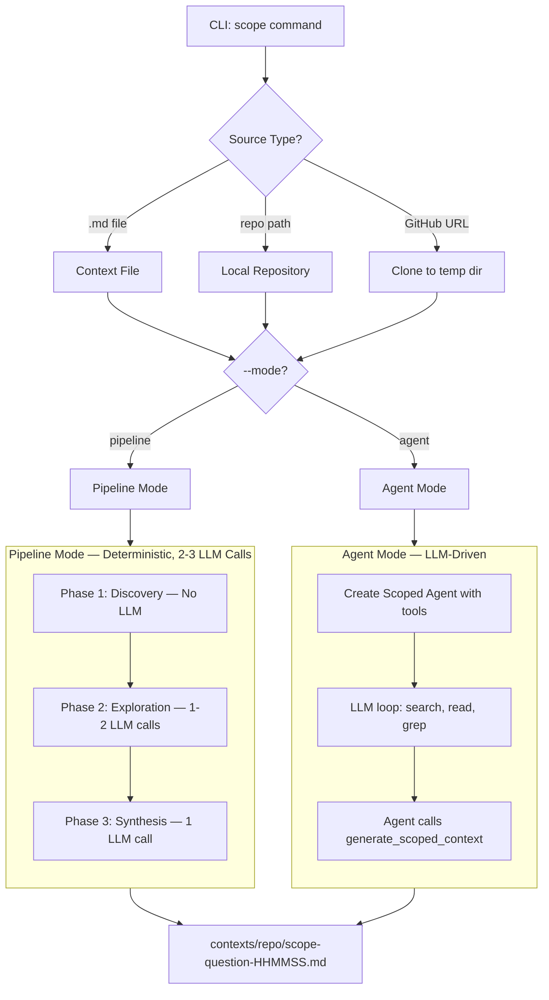
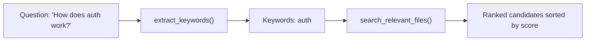
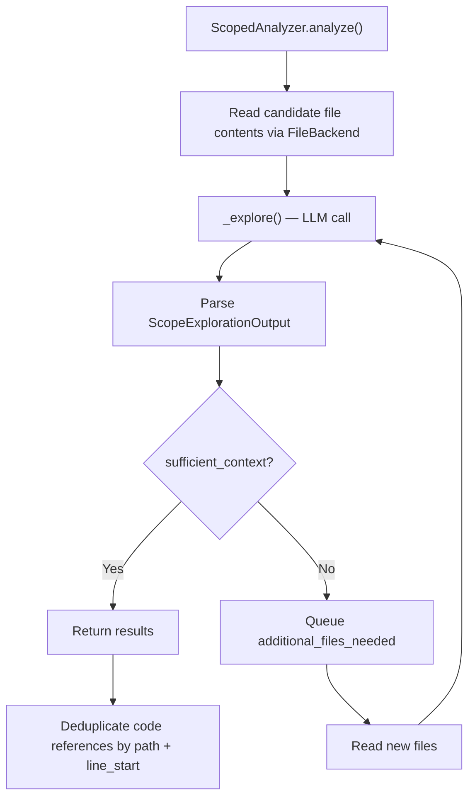
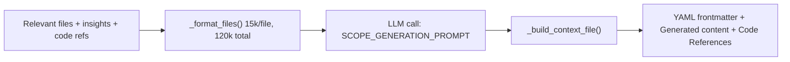
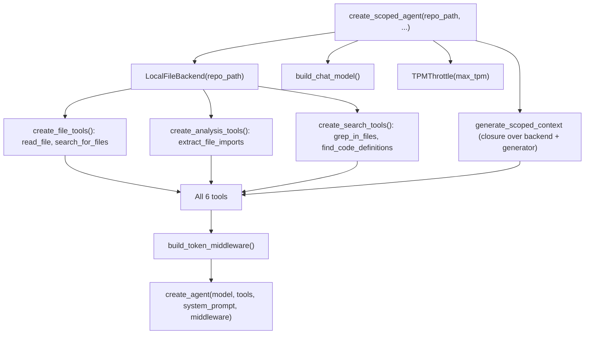
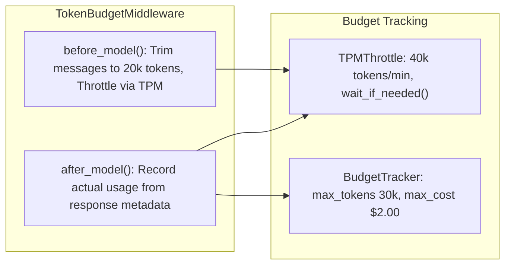

# Scoped Agent Flow — Complete Documentation

## 1. What It Does (The 30-Second Version)

The scoped context pipeline answers a **specific question** about a codebase — for example, *"How does authentication work?"* — and produces a focused markdown document with relevant code locations, insights, and references.

It's the counterpart to the **full context** pipeline (which documents the entire repo). Think of it as `grep` on steroids: it finds relevant files, has an LLM reason about what else to explore, then synthesizes everything into a useful document.

> **Two execution modes, one output.** The system offers a deterministic **pipeline** mode (predictable cost: 2-3 LLM calls) and a flexible **agent** mode (LLM decides what tools to use). Both produce the same output format. Pipeline mode is for cost control, agent mode is for better results on complex questions.

---

## 2. High-Level Architecture



**Entry point:** `src/agents/main.py:457` — the `scope` CLI command.

**Three valid source types:**

| Source | Example | What Happens |
|--------|---------|-------------|
| Repo path | `/path/to/repo` | Scopes directly |
| Context file | `contexts/repo/context.md` | Extracts repo path from YAML frontmatter |
| GitHub URL | `https://github.com/owner/repo` | Clones to temp dir, scopes, auto-cleans up |

---

## 3. Pipeline Mode — Step by Step

This is the default mode (`--mode pipeline`). Entry: `main.py:517` — `_scope_pipeline_mode()`.

### Phase 1: Discovery (No LLM)

**Goal:** Find candidate files without spending any tokens.



**File:** `src/agents/scoper/discovery.py`

**Step 1 — Keyword extraction** (`discovery.py:29`):

```
Input:  "How does authentication and authorization work?"
                |
Lowercase + split on non-alphanum:
  ["how", "does", "authentication", "and", "authorization", "work"]
                |
Filter: remove < 3 chars, remove stopwords
  ["authentication", "authorization"]
```

The stopword list (~80 words) includes both standard English stopwords AND domain terms like "functionality", "feature", "work" that appear in questions but aren't useful for file search.

**Step 2 — File search** (`discovery.py:69`):

Walks the filesystem with three scoring tiers:

| Match Type | Multiplier | Example |
|-----------|-----------|---------|
| Filename match | x2 | `auth_handler.py` matches "auth" |
| Path match | x1 | `src/auth/middleware.py` matches "auth" |
| Content match | x1 | File contains the word "auth" |

Files > 500KB are skipped. Only files with known extensions (`.py`, `.js`, `.ts`, `.md`, `.json`, `.yaml`, etc.) are content-searched. Results sorted by score, top 20 returned.

> **Why filename match gets x2 weight:** A file *named* `authentication.py` is almost certainly about authentication. A file that merely *contains* the word "auth" could be anything — a config file, a test helper, a comment. The scoring heuristic is simple but effective: name > path > content.

### Phase 2: Exploration (1-2 LLM Calls)

**Goal:** Intelligently expand context by following imports and dependencies.

**File:** `src/agents/scoper/scoped_analyzer.py`



The exploration loop runs for **at most 2 rounds** (`MAX_EXPLORATION_ROUNDS = 2`). Each round:

1. **Reads** queued files via the `FileBackend` abstraction
2. **Calls LLM** with `SCOPE_EXPLORATION_PROMPT` (from `llm/prompts.py:57`)
3. **Parses** structured output — the LLM returns a `ScopeExplorationOutput`:

```python
class ScopeExplorationOutput(BaseModel):
    additional_files_needed: List[str]    # Files to examine next
    reasoning: str                         # Why those files matter
    sufficient_context: bool               # Can we stop exploring?
    preliminary_insights: str              # What we've learned
    key_locations: List[KeyLocation]       # Important code with line numbers
```

4. **Stops early** if `sufficient_context == True` or no new files requested

**Content size limits** (prevent rate limit errors):

| Limit | Value | Purpose |
|-------|-------|---------|
| Per-file | 8,000 chars | Prevent one large file from dominating |
| Total content | 80,000 chars (~20k tokens) | Stay under 50k TPM API limit |
| File tree | 8,000 chars | Leave room for file contents |
| Max files in prompt | 12 | Prioritized by discovery score |

**Output:**

```python
{
    "relevant_files": {"path/file.py": "content..."},  # All examined files
    "insights": "Combined insights from all rounds",
    "code_references": [CodeReference(path, line_start, line_end, description)]
}
```

> **Why max 2 rounds?** Each round is an LLM call that costs tokens and adds latency. Empirically, 2 rounds are enough: Round 1 reads the discovery candidates. Round 2 follows imports and finds related tests/configs. Beyond that, diminishing returns. The LLM can also short-circuit by setting `sufficient_context = True` after round 1.

### Phase 3: Synthesis (1 LLM Call)

**Goal:** Generate the final markdown document.

**File:** `src/agents/scoper/scoped_generator.py`



The generator:

1. **Formats** file contents (per-file limit: 15k chars, total: 120k chars)
2. **Calls LLM** with `SCOPE_GENERATION_PROMPT` — produces markdown with summary, relevant sections, key files, usage examples
3. **Builds final file** with YAML frontmatter + LLM content + code references section
4. **Writes** to `contexts/{repo_name}/scope-{sanitized_question}-{HHMMSS}.md`

**Output format:**

```yaml
---
source_repo: /path/to/repo
scope_question: "how does authentication work"
scan_date: 2025-01-22T10:30:00Z
model_used: anthropic/claude-sonnet-4-5-20250929
files_analyzed: 8
---

## Summary
...

## Key Files
- `src/auth/handler.py:45-78` - Main auth flow
...

## Code References
- `src/auth/handler.py:45-78` - Main authentication flow
- `src/middleware/session.py:12-30` - Session validation
```

---

## 4. Agent Mode — How It Works Differently

**Entry:** `main.py:607` — `_scope_agent_mode()`

Instead of three fixed phases, the agent mode gives the LLM a set of **tools** and lets it decide the exploration strategy.

### Agent Construction

**File:** `src/agents/scoper/agent.py:110` — `create_scoped_agent()`



### The 6 Tools

| Tool | Purpose | Limits |
|------|---------|--------|
| `search_for_files` | Keyword search by name/content | max 15 results |
| `grep_in_files` | Regex search with line numbers | max 15 results, 1 context line |
| `find_code_definitions` | Find function/class defs | max 15 results |
| `read_file` | Read file content | max 8,000 chars |
| `extract_file_imports` | Parse imports from Python/JS/TS | — |
| `generate_scoped_context` | Produce final output | Takes paths, reads internally |

> **Tighter limits than full-context agent.** The scoped agent uses 8k char reads vs 13.5k for the full agent, and 15 search results vs 30. This is intentional — scoped questions need less breadth, and tighter limits keep the conversation context smaller, letting the agent make more tool calls before hitting token limits.

### Agent Execution Loop

The system prompt (`agent.py:24`) guides the LLM through a 4-step strategy:

```
Step 1: SEARCH — search_for_files, grep_in_files, find_code_definitions
Step 2: READ — read_file, extract_file_imports
Step 3: FOLLOW DEPS — read imported files, check tests, grep for usages
Step 4: GENERATE — call generate_scoped_context when confident
```

The LLM decides dynamically. A typical execution against a codebase might look like:

```
Turn 1:  LLM calls search_for_files(["auth", "login"])
Turn 2:  LLM calls read_file("src/auth/handler.py")
Turn 3:  LLM calls extract_file_imports("src/auth/handler.py")
Turn 4:  LLM calls read_file("src/middleware/session.py")
Turn 5:  LLM calls grep_in_files("authenticate", path="src/")
Turn 6:  LLM calls read_file("tests/test_auth.py")
Turn 7:  LLM calls generate_scoped_context(
             question="How does authentication work?",
             relevant_file_paths=["src/auth/handler.py", ...],
             insights="The auth system uses JWT tokens...",
             code_references=[{path: "src/auth/handler.py", line_start: 45, ...}]
         )
```

### The generate_scoped_context Tool (Critical Design)

This tool (`agent.py:192`) is a closure that captures the `backend` and `generator`:

```python
@tool
def generate_scoped_context(
    question: str,
    relevant_file_paths: list[str],   # PATHS, not contents!
    insights: str,
    code_references: list[dict] | None = None,
) -> dict:
```

**Key design decision:** The agent passes **file paths**, not file contents. The tool reads contents internally via the backend. This prevents the LLM from having to echo back entire file contents in its tool call, saving significant tokens.

---

## 5. Budget and Rate Limiting



**Three layers of cost control:**

| Layer | Component | What It Does |
|-------|-----------|-------------|
| Per-request | `TokenBudgetMiddleware.before_model()` | Trims messages to `max_input_tokens` (20k) |
| Rate limiting | `TPMThrottle` | Sleeps if approaching 40k tokens/min |
| Total budget | `BudgetTracker` (optional) | Raises `BudgetExceededError` at 30k total tokens or $2.00 |

The middleware hooks into the agent loop at two points:

- **before_model**: trim + throttle
- **after_model**: extract `usage_metadata` from the `AIMessage` and feed it to both the throttle and the optional budget tracker

---

## 6. Concrete Walkthrough: Scoping "authentication" Against a Codebase

Let's trace a pipeline-mode execution step by step:

```
$ python -m agents.main scope /path/to/myapp -q "How does authentication work?"
```

### Discovery Phase

```
extract_keywords("How does authentication work?")
  -> normalize: "how does authentication work"
  -> split:     ["how", "does", "authentication", "work"]
  -> filter:    "how"  (stopword, removed)
                "does" (stopword, removed)
                "authentication" (kept)
                "work" (stopword, removed)
  -> result:    ["authentication"]

search_relevant_files(repo, ["authentication"]):
  Walking filesystem...
  |-- src/auth/handler.py       -> filename match "auth" -> score: 2
  |-- src/auth/__init__.py      -> path match "auth"     -> score: 1
  |-- src/middleware/session.py  -> content match         -> score: 1
  |-- tests/test_auth.py        -> filename match        -> score: 2
  |-- config/auth.yaml          -> filename match        -> score: 2

  Sorted: [handler.py:2, test_auth.py:2, auth.yaml:2, __init__.py:1, session.py:1]
```

### Exploration Phase

```
Round 1:
  Read: handler.py, test_auth.py, auth.yaml, __init__.py, session.py
  LLM call -> ScopeExplorationOutput:
    additional_files_needed: ["src/models/user.py", "src/auth/jwt.py"]
    sufficient_context: false
    preliminary_insights: "JWT-based auth in handler.py:23-67..."
    key_locations: [{path: "src/auth/handler.py", line_start: 23, line_end: 67}]

Round 2:
  Read: user.py, jwt.py
  LLM call -> ScopeExplorationOutput:
    additional_files_needed: []
    sufficient_context: true
    preliminary_insights: "Complete JWT flow: jwt.py generates tokens..."
    key_locations: [{path: "src/auth/jwt.py", line_start: 10, line_end: 45}]

Total: 7 files examined, 2 LLM calls
```

### Synthesis Phase

```
Format 7 files (respecting 15k/file, 120k total limits)
LLM call with SCOPE_GENERATION_PROMPT
-> Generates markdown with summary + sections + key files
-> Adds YAML frontmatter + code references
-> Writes: contexts/myapp/scope-how-does-authentication-143022.md
```

**Total LLM calls: 3** (2 exploration + 1 generation)

---

## 7. Key Files Reference

| File | Role | Lines of Interest |
|------|------|-------------------|
| `src/agents/main.py:457-677` | CLI entry point, mode dispatching | `scope()`, `_scope_pipeline_mode()`, `_scope_agent_mode()` |
| `src/agents/scoper/discovery.py:29-134` | Keyword extraction + file search | `extract_keywords()`, `search_relevant_files()` |
| `src/agents/scoper/scoped_analyzer.py:61-311` | LLM-guided exploration loop | `ScopedAnalyzer.analyze()`, `_explore()` |
| `src/agents/scoper/scoped_generator.py:22-207` | Final markdown generation | `ScopedGenerator.generate()`, `_build_context_file()` |
| `src/agents/scoper/agent.py:24-437` | Agent factory + system prompt + tools | `create_scoped_agent()`, `SCOPED_AGENT_SYSTEM_PROMPT` |
| `src/agents/llm/prompts.py:57-124` | LLM prompt templates | `SCOPE_EXPLORATION_PROMPT`, `SCOPE_GENERATION_PROMPT` |
| `src/agents/middleware/token_budget.py` | Token budget middleware | `before_model()`, `after_model()` |

---

## 8. Design Decisions Worth Understanding

### Why two modes?

**Pipeline** = predictable. You know it makes exactly 2-3 LLM calls. Good for CI, batch processing, cost-sensitive usage.

**Agent** = flexible. The LLM can use `grep_in_files` to find specific patterns, follow imports, and make judgment calls about what to read. Better results on complex questions, but variable cost.

### Why does the generate tool take paths, not contents?

If the agent passed file contents in the tool call, those contents would be serialized into the conversation as the tool call arguments, then the tool would echo them back as the result. That's **double the tokens** for zero benefit. Instead, the tool takes paths and reads contents via the `FileBackend` — the LLM never sees the raw content twice.

### Why separate content limits for exploration vs generation?

Exploration (80k chars ~ 20k tokens) needs room for the LLM to reason about what else to fetch. Generation (120k chars ~ 30k tokens) needs more room because it's producing a comprehensive document and should see as much relevant code as possible. Both stay safely under API limits.

### Why deduplicate by (path, line_start)?

Across multiple exploration rounds, the LLM might flag the same code location. Without deduplication, the code references section would have repeated entries. The `(path, line_start)` tuple is a good enough key — two references to the same starting line in the same file are almost certainly duplicates.
